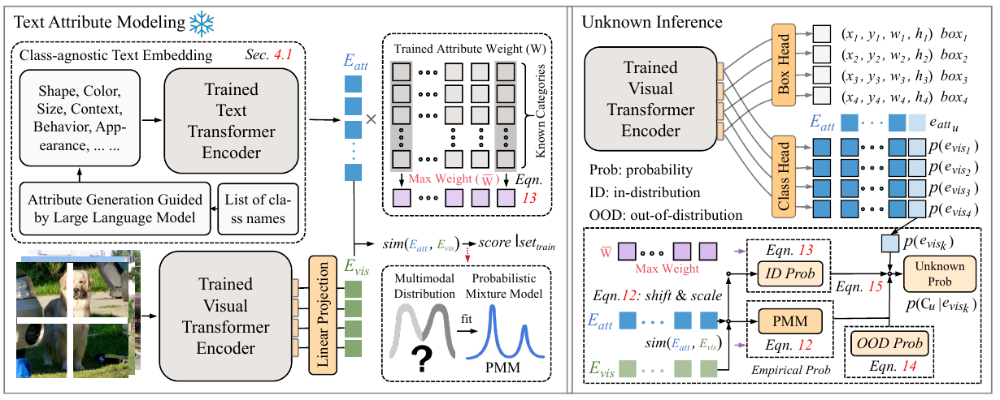

# UMB: Understanding Model Behavior for Open-World object Detection
## Abstarct
Open-World Object Detection (OWOD) is a challenging task that requires the detector to identify unlabeled objects and continuously demands the detector to learn new knowledge based on existing ones. Existing methods primarily focus on recalling unknown objects, neglecting to explore the reasons behind them. This paper aims to understand the model's behavior in predicting the unknown category. First, we model the text attribute and the positive sample probability, obtaining their empirical probability, which can be seen as the detector's estimation of the likelihood of the target with certain known attributes being predicted as the foreground. Then, we jointly decide whether the current object should be categorized in the unknown category based on the empirical, the in-distribution, and the out-of-distribution probability. Finally, based on the decision-making process, we can infer the similarity of an unknown object to known classes and identify the attribute with the most significant impact on the decision-making process. This additional information can help us understand the behavior of the model's prediction in the unknown class. The evaluation results on the Real-World Object Detection (RWD) benchmark, which consists of five real-world application datasets, show that we surpassed the previous state-of-the-art (SOTA) with an absolute gain of 5.3 mAP for unknown classes, reaching 20.5 mAP. 

## Overall Structure


## Visualization


## Start
### Datasets
Real-World Object Detection (RWD) benchmark. (see FOMO):
Dataset setup instruction is in [DATASET_SETUP.md](DATASET_SETUP.md).

## Run
run_rwd.sh - evaluation of all datasets on task 1 RWD Benchmark. 

run_rwd_t2.sh - evaluation of all datasets on task 2 RWD 


## Citation & Acknowledgements
Our code is based on FOMO and OWL-ViT. If you find our paper and code useful in your research, please consider giving a star :star: and citation :pencil:.

```bibtex

@InProceedings{Zohar_2023_CVPR,
    author    = {Zohar, Orr and Wang, Kuan-Chieh and Yeung, Serena},
    title     = {PROB: Probabilistic Objectness for Open World Object Detection},
    booktitle = {Proceedings of the IEEE/CVF Conference on Computer Vision and Pattern Recognition (CVPR)},
    month     = {June},
    year      = {2023},
    pages     = {11444-11453}
}
```
```bibtex
@article{minderer2022simple,
    title   = {Simple Open-Vocabulary Object Detection with Vision Transformers},
    author  = {Matthias Minderer, Alexey Gritsenko, Austin Stone, Maxim Neumann, Dirk Weissenborn, Alexey Dosovitskiy, Aravindh Mahendran, Anurag Arnab, Mostafa Dehghani, Zhuoran Shen, Xiao Wang, Xiaohua Zhai, Thomas Kipf, Neil Houlsby},
    journal = {ECCV},
    year    = {2022},
}
```
```bibtex
@InProceedings{zohar2023open,
    author    = {Zohar, Orr and Lozano, Alejandro and Goel, Shelly and Yeung, Serena and Wang, Kuan-Chieh},
    title     = {Open World Object Detection in the Era of Foundation Models},
    booktitle = {arXiv preprint arXiv:2312.05745},
    year      = {2023},
}
```
